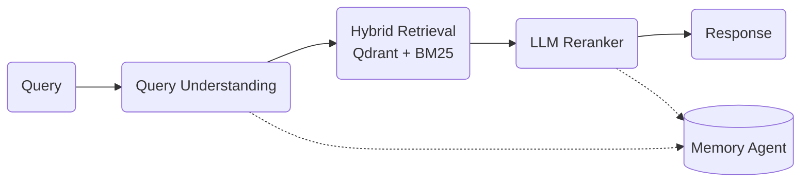

# Agentic E-Commerce Search
**Hybrid Search • Semantic Understanding • Multi-Agent System**

## Overview

This project is a **smart search system for e-commerce data** built to handle messy, real-world conditions.

Unlike traditional search engines that rely on clean product catalogs, this system works even when:
- Product names are generic
- Metadata is missing or inconsistent
- Reviews are noisy
- Product availability differs by country

The system uses **semantic embeddings, hybrid retrieval, and lightweight agents** to understand user intent and return relevant results.

---

## What the System Does

Given a vague query like:

> “cheap laptop in France”  
> “premium blender”

The system:
1. Understands what the user is looking for
2. Infers missing details like price intent or country
3. Searches using both **semantic meaning** and **keywords**
4. Reranks results to surface the most relevant products
5. Learns from previous queries during the session

All of this runs locally in Python and is exposed through a **REST API**.

---

## Dataset

This project uses the Kaggle dataset:

**E-Commerce Purchases and Reviews**  
https://www.kaggle.com/datasets/pruthvirajgshitole/e-commerce-purchases-and-reviews

**Files used:**
- `customer_purchase_data.csv`
- `customer_reviews_data.csv`

The data is intentionally **noisy and incomplete**, which makes it ideal for testing real-world search behavior.

---

## Data Challenges (Why This Is Hard)

The dataset has several problems that shape the system design:

- No structured product catalog  
- Product IDs are reused across countries  
- Very generic product names (e.g., “Camera”)  
- Short, repetitive, low-signal reviews  
- Uneven product availability across countries  

Because of this, traditional keyword search performs poorly.

---

## How the System Works

The system is built from **three main parts**:

### Embedding Pipeline

Raw product data is converted into a single **canonical text** per product, combining:
- Product name
- Category
- Country
- Price level (Low / Mid / High)
- Selected review snippets

This text is embedded using a **SentenceTransformer model** and indexed in **Qdrant** for fast semantic search.

This step:
- Adds meaning to generic product names
- Reduces noise from bad reviews
- Separates products that share the same ID

---

### Agentic Search Flow

A small set of Python agents work together to answer each query:



- **Query Understanding Agent**  
  Extracts product type, country, and price intent from the query.

- **Hybrid Retrieval Agent**  
  Combines semantic search in Qdrant with BM25 keyword search, orchestrated
  through LangChain (`BM25Retriever` + `EnsembleRetriever`) to find candidates.

- **Reranker Agent**  
  Uses an LLM to score and reorder results for relevance.

- **Memory Agent**  
  Remembers things like country or price preference across queries, scoped
  per user (see [Memory-Aware Search](#memory-aware-search) below).

This layered approach stabilizes search even when data is incomplete.

---

### Memory-Aware Search

The system remembers user preferences during a session:
- Country
- Price sensitivity

This allows follow-up queries like:
> “show me cheaper ones”

without needing to restate all constraints.

Memory is scoped per caller via an optional `user_id` on the `/search` request:

```bash
curl -X POST http://127.0.0.1:8000/search \
  -H "Content-Type: application/json" \
  -d '{"query": "premium camera", "user_id": "alice"}'
```

Each `user_id` gets its own preference/history files under `data/memory/users/{user_id}/`,
so one caller's preferences never leak into another's. Omitting `user_id` falls back to
a single shared memory (useful for quick local testing, matching the original behavior).

---

## Evaluation Results

`search_metrics.py` runs a sample of realistic queries generated from real purchase logs
through the full pipeline and scores the results with **RAGAS**:

```json
{
  "p99_latency_ms": 908.05,
  "faithfulness": 1.0,
  "llm_context_precision_without_reference": 0.0,
  "semantic_similarity": 0.60
}
```

(Example from a 3-query sample run — see [How to Run](#how-to-run) below to reproduce
with a larger sample.)

### What This Means

* **faithfulness** — is the surfaced answer grounded in the retrieved product text (no
  hallucinated details)?
* **llm_context_precision_without_reference** — are the contexts Qdrant retrieved actually
  relevant to the query?
* **semantic_similarity** — used here as an *answer relevance* proxy: how closely does the
  surfaced answer align with the query itself (RAGAS's own `ResponseRelevancy` metric
  reliably crashes CUDA with this project's small local completion-only Qwen2-1.5B setup —
  see the comment at the top of `search_metrics.py` for why).
* **p99_latency_ms** — worst-case latency, acceptable for an MVP with LLM reranking.

---

## Inspecting the Qdrant Vector Store

Qdrant runs in **embedded/local mode** (no server) at `data/embeddings/qdrant/`. There's no
web UI for local mode, but you can open it directly from Python:

```python
from qdrant_client import QdrantClient

client = QdrantClient(path="data/embeddings/qdrant")
print(client.get_collection("products"))  # vector size, distance metric, point count

# Look at a few points: id, 768-dim embedding vector, and full metadata payload
points, _ = client.scroll("products", limit=3, with_payload=True, with_vectors=True)
for p in points:
    print(p.id, p.payload["variant_id"], p.payload["product_name"], len(p.vector))
```

Under the hood, local-mode Qdrant stores everything in a single SQLite file at
`data/embeddings/qdrant/collection/products/storage.sqlite`, one table `points(id, point)`
where `point` is a **pickled `PointStruct`** (id + vector + payload). You can decode a raw
row directly without going through `qdrant_client` if you just want to peek:

```python
import sqlite3, pickle

conn = sqlite3.connect("data/embeddings/qdrant/collection/products/storage.sqlite")
row = conn.execute("SELECT point FROM points LIMIT 1").fetchone()
point = pickle.loads(row[0])
print(point.payload)          # variant_id, product_name, category, country, price_level, price, text
print(point.vector[:5])       # first 5 dims of the 768-dim embedding
```

---

## Production Notes

* Qdrant is used for fast semantic retrieval
* LangChain orchestrates retrieval flow
* LLM reranking improves result quality
* The system can scale horizontally
* Faster cross-encoders can replace the LLM later to reduce latency

---

## Project Structure

```bash
agentic-ecommerce-search/
│
├── agents/
│   ├── agents.py              # QueryUnderstanding, Retrieval, Reranker agents
│   └── memory_agent.py        # MemoryAgent
│
├── api.py                     # FastAPI server exposing /search endpoint
│
├── embeddings_pipeline/       # Embedding generation + Qdrant index builders
│   ├── build_qdrant_index.py
│   ├── download_datasets.py
│   └── embed_products.py
│
├── configs/                   # Configuration files
│   ├── config_agents.yaml
│   └── config_embedding.yaml
│
├── data/                      # Raw data and generated artifacts
│   ├── raw/                   # Original Kaggle CSV files
│   ├── embeddings/            # Precomputed embeddings + Qdrant index
│   └── memory/                # Memory snapshots
│
├── llm/                       # LLM client wrapper
│   └── llm_client.py
│
├── results/                   # Evaluation outputs
│   └── metrics.json            # latency + RAGAS scores (see search_metrics.py)
│
├── search_orchestration.py    # End-to-end search pipeline
├── search_metrics.py          # RAGAS-based evaluation
├── build_pipeline.py          # Runner for embedding pipeline
│
├── docker-compose.yml         # GPU-enabled Docker setup
├── Dockerfile                 # Production container
├── requirements.txt
└── README.md
```

---

## How to Run

### Option A: Docker

The system runs inside a **GPU-enabled Docker container**.

```bash
docker compose build
docker compose up
```

Once running, access the API at `http://127.0.0.1:8000/docs`.

### Option B: Local venv

```bash
python3 -m venv .venv
source .venv/bin/activate
pip install -r requirements.txt
```

If your GPU driver is older than what the default PyTorch wheel expects (a
`RuntimeError: The NVIDIA driver on your system is too old` at startup), install a
matching CUDA build instead, e.g. for CUDA 12.x drivers:

```bash
pip install "torch==2.4.0" --index-url https://download.pytorch.org/whl/cu121
```

**Run the API:**

```bash
uvicorn api:app --reload --port 8000
```

**Test it (a good example query):**

```bash
curl -X POST http://127.0.0.1:8000/search \
  -H "Content-Type: application/json" \
  -d '{"query": "cheap laptop"}' | python3 -m json.tool
```

This returns 10 correctly-filtered `Low` price-tier Laptop results, ranked by semantic
score — a good sanity check that retrieval, price-intent parsing, and reranking are all
working together. (A query like `"cheap laptop in France"` will legitimately return an
empty list — this dataset has no Laptop stocked in France, not a bug; see
`data/embeddings/metadata.sqlite`'s `chunks` table to check what's available per country.)

Health/readiness checks: `curl http://127.0.0.1:8000/health` and `.../ready`.

**Run the evaluation (the project's test suite):**

```bash
python3 search_metrics.py
```

Writes `results/metrics.json` (see [Evaluation Results](#evaluation-results)). Note: this
loads its own copy of the embedding + LLM models onto the GPU, so stop the API server
first if you're on a memory-constrained GPU (an 8GB card can't hold both).

The sample size and number of retrieved contexts scored per query are capped in
`search_metrics.py` (`DEFAULT_SAMPLE_SIZE`, `MAX_CONTEXTS_PER_SAMPLE`) since RAGAS's
faithfulness/context-precision metrics make one LLM generation call per context — increase
them for a more statistically meaningful run at the cost of runtime (roughly linear in
`sample_size * contexts_per_sample`).

---

## Conclusion

This project shows how **semantic embeddings, hybrid retrieval, and agent-based orchestration**
can turn noisy, incomplete e-commerce data into a practical search system.

It is:

* Robust to missing metadata
* Designed for real-world messiness
* Ready for production extension and scaling
```
